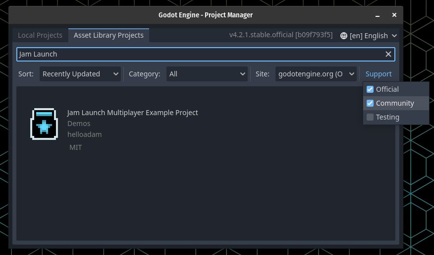
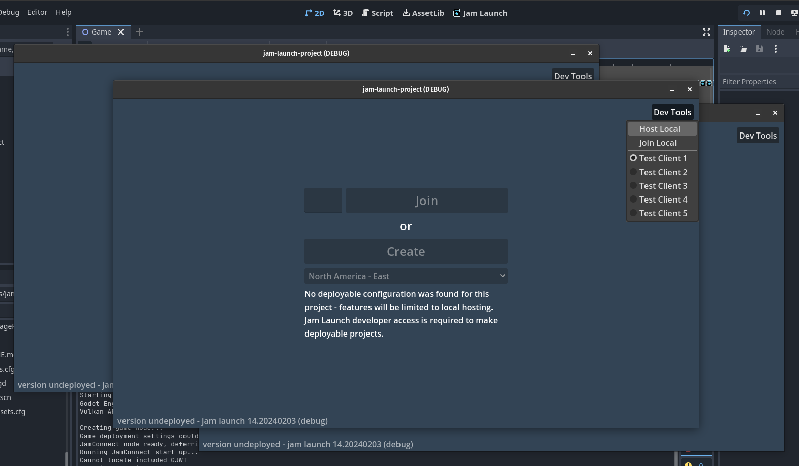
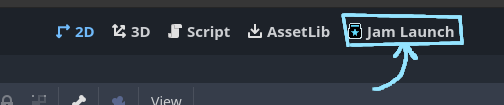
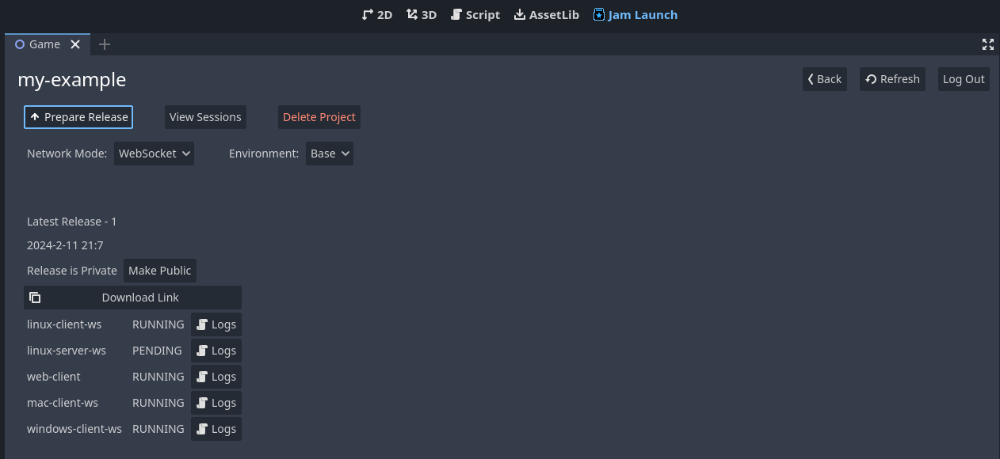
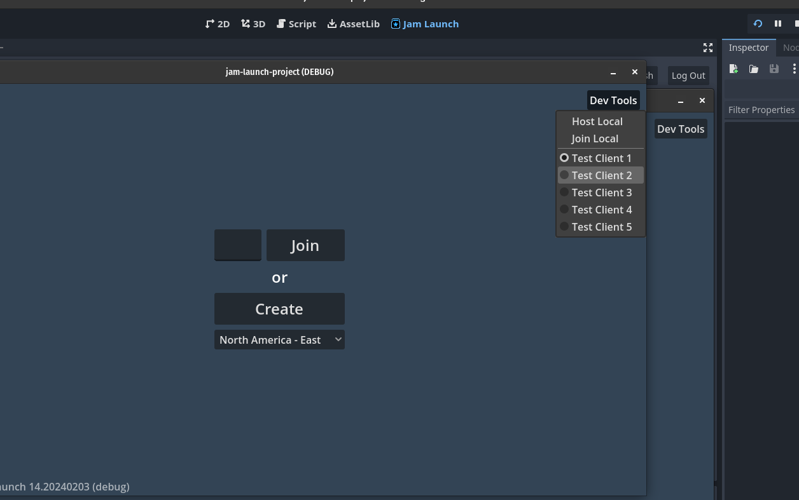

Getting Started
###################

The purpose of this guide is to walk you through the recommended steps for
trying out Jam Launch for the first time. There is a companion video that may
be helpful for clarifying any ambiguities.

.. youtube:: U4x1kvt804k

Get the Godot Engine
************************************

If you don't already have the Godot game engine,
`download it from godotengine.org <https://godotengine.org/download>`_.

Familiarity with Godot is useful, but not necessary for trying out Jam Launch.
If you are new to Godot, we are happy to help you get familiar with it, and
their `official docs <https://docs.godotengine.org/en/stable/index.html>`_ are
fantastic.

Try out the example project locally
************************************

Once you have Godot, open the Project Manager, navigate to the "Asset Library
Projects", and search for the Jam Launch Multiplayer Example project. Make sure
the "Community" box is checked in the "Support" menu, otherwise it may not
appear.

Download and open the project in Godot. When you open the project, you will
likely encounter import errors and need to reload the project by going to the
"Project" menu and selecting "Reload Current Project".

Once the project is reloaded, go to the "Debug -> Run Multiple Instances" menu
and choose at least 3 instances. Now run the program by pressing the play button
or the F5 key.

With the 3+ instances running, click on the "Dev Tools" button in the top right
corner and choose "Host Local" in one of them. In the other instances, select
"Join Local". This should result in 2 clients connected to the local server. The
game state should sync across the clients (game controls: arrow keys and space).

Jam Launch hosts your game server almost exactly as it is run locally, so you
are able to rapidly test and iterate on your multiplayer functionality without
any additional tooling or deployment delays.

Get a Jam Launch account
************************************

Playing Jam Launch games requires a free Jam Launch account. You can sign up for
one at `app.jamlaunch.com <https://app.jamlaunch.com/?signUp=1>`_.

Your account information is only ever used in Jam Launch. We might offer opt-in
features at some point (e.g. a mailing list), but we are completely uninterested
in wasting your time, and very interested in protecting your privacy. 

Play the deployed example project
************************************

Once you have a Jam Launch account, you can
`play the example game <https://app.jamlaunch.com/g/FP8XMOFFKp/x16>`_. Try it
out with friends, and see if it meets your expectations. Make sure to create the
game in a nearby region, otherwise the latency may be very noticeable. If
there aren't any nearby regions, we will add the nearest feasible region if you
sign up for developer access (and we will refund you if this is determined to be
inadequate). 

Sign up for Developer Access
************************************

If you want to deploy games with Jam Launch, you must add a paid developer
access subscription to your account (currently $20/month). This helps us cover
hosting infrastructure fees, and minimizes bad faith use of the platform.

We will roll out a new pricing structure as the platform matures in 2024, but
we'd love for you to join the small group of pioneering developers on the
platform already. We suspect you'll find great value in our support and
consultation even if your project is in an early stage or if we aren't providing
exactly what you need yet.

Deploy the Example Project
************************************

Once you have developer access, you should be able to use the Jam Launch editor
plugin which allows you to deploy your game directly from the Godot editor.

Copy the "Editor Key" from the
`Jam Launch web dashboard <https://app.jamlaunch.com>`_
and navigate to the Godot editor plugin in the example project.

Paste the key into the editor plugin and click on the "New Project" button to
make a new Jam Launch project. With the project opened, change the
"Network Mode" to "WebSocket" and then click the "Prepare Release" button. This
will send your copy of the example project to be built in Jam Launch.

Once the project finishes building, you can access the clients in a web browser
with the link provided by the "Download Link" button, and the server will be
available to be provisioned by Jam Launch by the clients. You can try out the
game just like the deployed example from the download link. You can also create
and join sessions using test clients from the editor-launched sessions in order
to get around the 1-session-per-player limit imposed by cloud deployments.

Now you can make changes to the example or just put the addon into your own
game. Please :doc:`reach out <contact/index>` and let us know if you need any
help or want to chat!